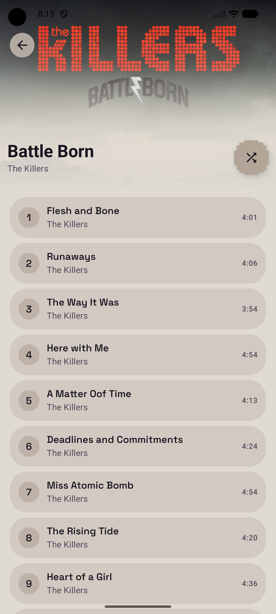
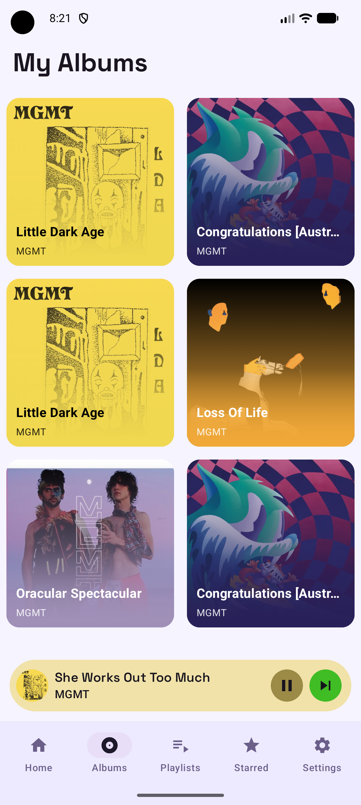
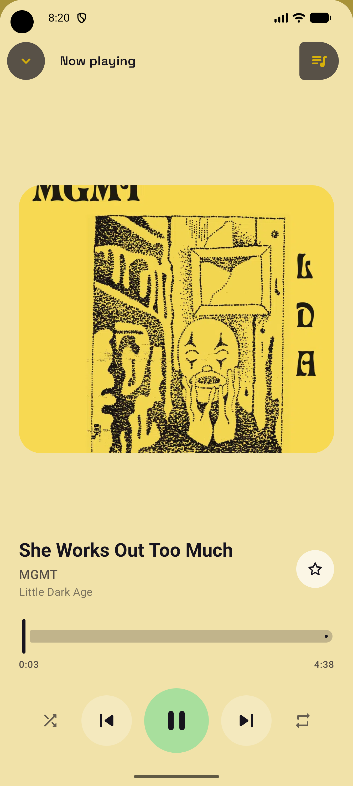

# Cassette for Android

> A native Android client for Subsonic, OpenSubsonic, and Navidrome servers. Built for people who self-host their music.

[](LICENSE)
[](#requirements)
[](https://kotlinlang.org)
[](https://www.jetbrains.com/compose-multiplatform/)

---


## Screenshots

| Album                              | AlbumList                        | Player                            |
|------------------------------------|----------------------------------|-----------------------------------|
|  |  |  | 

---

## What is Cassette?

Cassette is a Kotlin music client for Android, built for people who run their own music server. It speaks the Subsonic and OpenSubsonic API, so it works with Navidrome and other compliant servers.

It is a streaming client for *your* library: no accounts, no subscriptions, no tracking. Your music stays between your device and your server.

Licensed under MPL-2.0.

---

## Features

**Listening**
- Native Android app with a shared Compose Multiplatform UI foundation, making it easy to test on desktop and potentially share business logic across platforms
- Streaming playback backed by AndroidX Media3 / ExoPlayer on Android
- Playback notification and platform media session integration
- Shuffle, repeat, seeking, next / previous controls, and queue management
- Persistent playback queue and playback session storage
- Star / unstar tracks from the player

**Library**
- Browse albums, playlists, recently added albums, and starred items
- Album, artist, and playlist detail screens
- Local cache for albums, artists, tracks, playlists, cover art, starred items, and playback data
- Pull-to-refresh on library screens that sync from your server
- Artists, tracks, and downloads are present in navigation and are being built incrementally

**Server & privacy**
- Subsonic and OpenSubsonic API support
- Navidrome is the primary target server
- Custom HTTP headers for servers behind a reverse proxy such as Cloudflare Access or Authelia
- Credentials are stored locally with platform encryption helpers
- No analytics and no third-party account requirement

---

## Installation

You can install the latest version of Cassette directly from GitHub releases. Just put the APK on your Android device and install it: https://github.com/CassetteLabs/cassette-android/releases/latest

### Build from source

1. **Requirements**
   - Android Studio with Android SDK 36
   - JDK 21 for Gradle, as configured by `gradle/gradle-daemon-jvm.properties`
   - A Subsonic / OpenSubsonic / Navidrome server to connect to

2. **Clone the repository**

   ```bash
   git clone git@github.com:CassetteLabs/cassette-android.git
   cd cassette-android
   ```

3. **Build the Android app**

   ```bash
   ./gradlew :androidApp:assembleDebug
   ```

4. **Run from Android Studio**
   - Open the repository in Android Studio
   - Select the `androidApp` run configuration
   - Run on an Android 8.0+ device or emulator

5. **First launch**
   - Cassette prompts for your server URL, username, and password
   - If your server sits behind a reverse proxy that needs custom request headers, add them in the advanced server configuration
   - Connect to verify the server and store the configuration locally

---

## Requirements

- Android 8.0 (API 26) or later
- A running Subsonic, OpenSubsonic, or Navidrome server. You can also use the Navidrome demo server: https://www.navidrome.org/demo/

---

## Server compatibility

Cassette works with servers that implement the Subsonic / OpenSubsonic API. [Navidrome](https://www.navidrome.org) is the recommended and primary-tested server.

If your server implements the Subsonic API and something does not behave correctly, [open an issue](https://github.com/CassetteLabs/cassette-android/issues).

---

## Architecture

This repository is a Kotlin Multiplatform Gradle project. Android is the priority platform, with shared code structured so desktop/JVM and iOS targets can reuse the same core where possible.

- **Apps** - `:androidApp` is the Android entry point, `:desktopApp` is the desktop/JVM entry point, and `:shared` exposes shared UI to platform apps.
- **UI** - Compose Multiplatform screens and view models live in `:shared:presentation`, mostly under `commonMain`.
- **Domain** - Use cases, models, and repository contracts live in `:shared:domain`.
- **Data** - Ktor remote clients, Room persistence, repositories, cover art processing, and player engines live in `:shared:data`.
- **Core** - Shared helpers, logging, platform encryption helpers, and common infrastructure live in `:shared:core`.
- **Dependency injection** - Koin modules are declared per module and started by `CassetteApplication` on Android.
- **Playback** - Platform-specific player engines implement shared playback contracts; Android uses Media3 / ExoPlayer.
- **Persistence** - Room and bundled SQLite store library cache, server configuration, cover art metadata, playback queue, and playback session state.

Module dependency direction is intentionally narrow: apps depend on `:shared`; `:shared` composes `:shared:core`, `:shared:domain`, `:shared:data`, and `:shared:presentation`; feature code should stay in the narrowest module and source set that can own it.

---

## Development

Useful Gradle commands:

```bash
./gradlew :androidApp:assembleDebug
./gradlew :androidApp:testDebugUnitTest
./gradlew :androidApp:lint
./gradlew :shared:domain:allTests
./gradlew :shared:data:allTests
./gradlew :shared:presentation:allTests
```

Desktop commands are available when a change affects desktop behavior:

```bash
./gradlew :desktopApp:run
./gradlew :desktopApp:hotRun --auto
```

---

## Roadmap

- Release the application in app stores
- Offline track downloads
- New home screen
- Album, playlist, artist, starred, and queue experiences
- Stable Android background playback and media controls
- Search
- Android TV implementation
- Android Auto implementation

---

## Links & support

- Website - [getcassette.app](https://getcassette.app)
- Feedback / bug reports - [GitHub Issues](https://github.com/CassetteLabs/cassette-android/issues)
- iOS / macOS app - [Cassette](https://github.com/CassetteLab/cassette)

---

## Contributing

Contributions are welcome. A few things before you start:

- **Discuss before coding** - open an issue before working on a larger feature or architectural change.
- **Keep shared code shared** - prefer `commonMain` unless platform APIs require `androidMain`, `iosMain`, or `jvmMain`.
- **Preserve Android first** - when a trade-off is required, protect Android behavior and build health.
- **Keep dependencies narrow** - add libraries to `gradle/libs.versions.toml` and wire them only to the source set that needs them.
- **Use conventional commits** - `feat`, `fix`, `refactor`, `docs`, `chore`, etc.

---

## License

Cassette is licensed under [MPL-2.0](LICENSE).

- You can use, study, modify, and redistribute the source.
- Modified files stay under MPL-2.0; you may combine them with proprietary code in a Larger Work.

---
